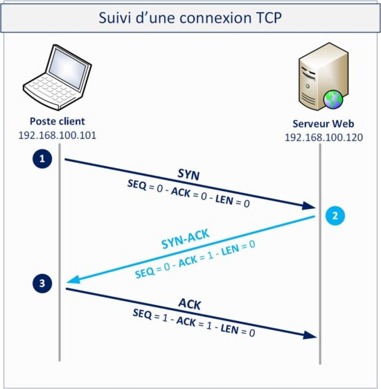

# TPs BE Reseau - 3 MIC E - BORE & VACCARO

Voici le compte rendu de notre projet Be_rzo.

## Avancement


 - [✅] - MICTCP-v1
 - [✅] - MICTCP-v2
 - [✅] - MICTCP-v3
 - [✅] - MICTCP-v4.1/MICTCP-v4.2
 

## Principe
Ce Be_rzo vient en complément du Bureau d'étude du premier semestre.\
Le principe de ce BE est de (re)créer un mécanisme de communication (Texte / Vidéo) entre deux utilisateurs distincts.\
Contrairement au précédent BE, ici nous allons non plus nous concentrer sur la communication Utilisateur/Programme mais bien Programme/Programme.

## Usage
Communication textuel :
```
./tsock_texte [-p|-s destination] port
```
Communication visuel :
```
./tsock_video [-p|-s] [-t (tcp|mictcp)]
```

## Phase d'établissement de connection
Durant la phase d'établissement, nous avons choisi de traiter les requêtes depuis la fonction :
```
void process_received_PDU(mic_tcp_pdu pdu, mic_tcp_ip_addr local_addr, mic_tcp_ip_addr remote_addr)
```
Cela rend le programme beaucoup plus facile, et évite des saut de fonctions inutiles.\
Durant cette phase de connection, nous avons opter pour un mécanisme "3-way Handshake" sans reprise de pertes.



## Transfert de message
Une fois la phase de connection établie, la phase de transfert se déroule de la manière la plus simple possible :
- La source envoie un message
- Le puits reçoit le message et envoie un ack
- La source reçoit un ack, et passe au message suivant.

Cependant dans certains cas, des pertes vont avoir lieu sur le canal de transmission.

### Mécanisme de reprise des pertes et usage de la tolerance
Nous avons plusieurs manières d'implémenter un mécanisme de reprise de perte.\
Nous avons décider de choisir deux méthodes distinctes en fonction de l'usage (Texte ou Vidéo).

#### Comment repérer une perte de transmission 
Afin de repérer des possibles erreurs de transmission, nous allons utiliser le principe de numéro de séquence.\
Le récepteur (Puits) et l'Envoyeur (Source) vont se sychroniser sur un numéro de séquence (par défaut : 0)\
Ainsi à chaque message envoyé, le numéro de séquence va basculer entre 0 et 1. *(sequence_suivante = sequence_actuelle + 1 % 2)* \
Ainsi si les numéros de séquence ne plus égaux, un paquet s'est égaré. 

#### Usage textuel
Dans cet usage, aucune perte n'est toléré. Il est impossible de maintenir une discussion avec une lettre sur 5 qui "disparait"

#### Usage vidéo
Dans cet usage, quelques pertes sont envisageable et ne generons en aucun cas l'expérience utilisateur, nous avons donc opté pour une reprise de pertes avec une fenêtre glissante.\
Une tolérance (Par défaut : 80%) qui va représenter la quantité de perte autorisé sur une courte séquence (Par défaut : 10 paquets).\
 *Par exemple :* 
 -  *Les 9 derniers paquets ont été transmis avec réussite, si le 10ème paquet échoue et que la tolerance est de 80%, le paquet ne sera pas re-transmis*
 - *Dans les 9 derniers paquets, 2 ont déjà échoué, si le 10ème paquet échoue et que la tolérence est de 80%, le paquet sera retransmis*

De plus, il est impossible d'avoir deux pertes d'affilé sans retransmission. 


## Auteurs

[Luka Boré](https://github.com/Luka-hash-go)\
[Mathieu Vaccaro](https://github.com/mathieuvaccaro)
